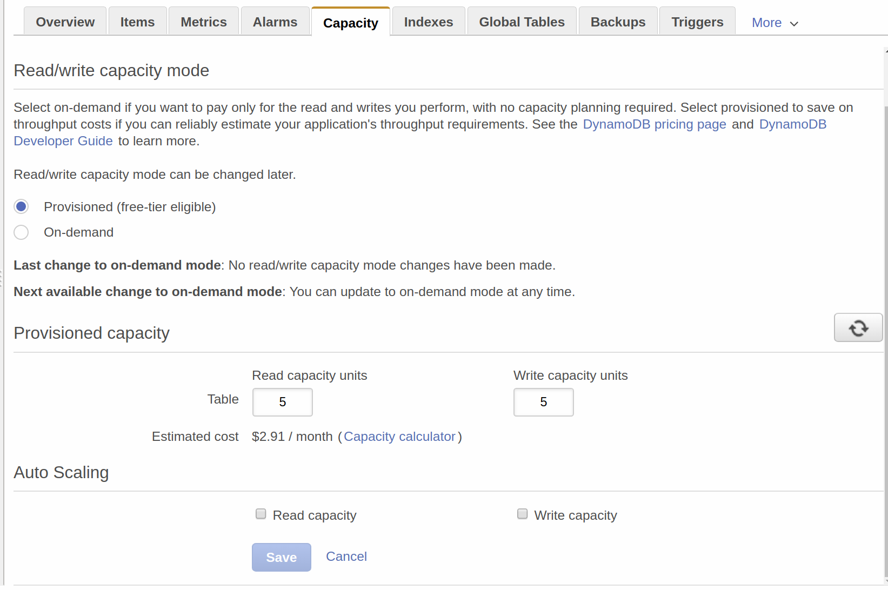
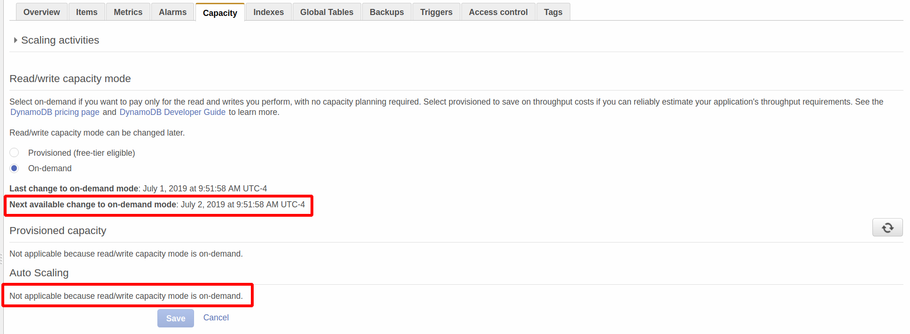
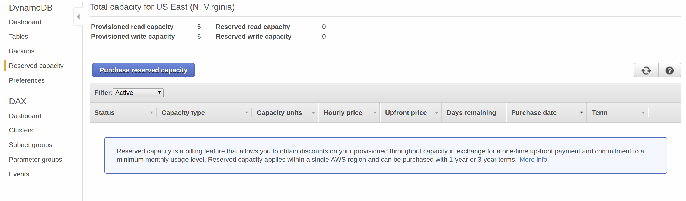
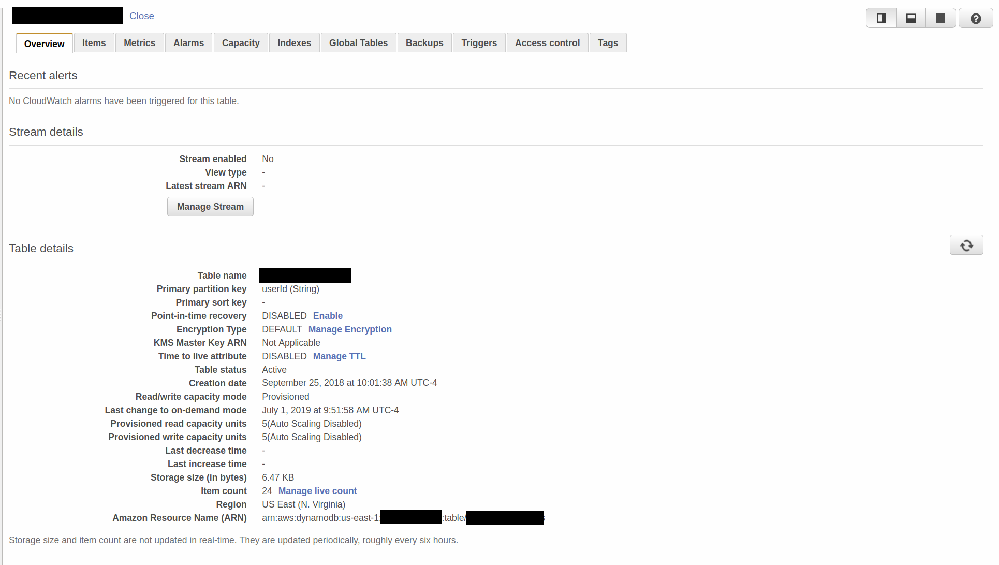

# DynamoDB


Having used AWS DynamoDB for [Alexa](http://github.com/mramshaw/Alexa-Stuff/tree/master/DynamoDB),
it was time to investigate DynamoDB as a NoSQL database in its own right.

## Contents

The contents are as follows:

* [Motivation](#motivation)
    * [DBaaS](#dbaas)
    * [Auto-scaling](#auto-scaling)
    * [Global Tables](#global-tables)
    * [Eventually Consistent](#eventually-consistent)
    * [Advanced query capabilities](#advanced-query-capabilities)
    * [Ease of use](#ease-of-use)
* [Alternatives](#alternatives)
    * [AWS](#aws)
    * [Third-Party](#third-party)
* [Performance](#performance)
* [Costs](#costs)
    * [Capacity](#capacity)
    * [Reserved Capacity](#reserved-capacity)
* [DDL](#ddl)
* [Horror Stories](#horror-stories)
* [Offline use](#offline-use)
    * [Docker Tags](#docker-tags)
* [Security](#security)
    * [Web Identity Federation](#web-identity-federation)
* [Reference](#reference)
    * [Serverless](#serverless)
    * [Tracking Your Free Tier Usage](#tracking-your-free-tier-usage)
    * [DynamoDB Accelerator](#dynamodb-accelerator)
    * [AWS Billing and Cost Management](#aws-billing-and-cost-management)
    * [AWS Simple Monthly Calculator](#aws-simple-monthly-calculator)
    * [Billing alarm](#billing-alarm)
    * [Local usage](#local-usage)
* [To Do](#to-do)

## Motivation

I will be examining DynamoDB for use in ___serverless architectures___ as a replacement for
[MongoDB](http://www.mongodb.com/).

#### DBaaS

Specifically, I will be examining DynamoDB (and alternatives) for __Database as a Service (DBaaS)__ capabilities.

[A principal component of serverless architectures is the ability to outsource the bulk of database operations.]

In particular, the ability to scale and maintain NoSQL databases at enterprise levels can involve substantial time
and costs.

DBaaS is generally a premium cloud offering and can get expensive quickly. Even so, it's still probably far less
expensive than managing an on-premises database. The choice of cloud provider is important as egress charges tend
to be prohibitive (MongoDB Atlas can use any of the major cloud providers).

DBaaS is supposed to be a cost-effective way to handle bursty traffic where volumes are unknown. The classic
example is getting a mention on SlashDot or HackerNoon that generates flash crowds - usually there is not enough
capacity to handle the load and the servers fall over. Or to use a more recent success story, consider
[Pokemon Go](http://www.techrepublic.com/article/pokemon-go-how-the-cloud-saved-the-smash-hit-game-from-collapse/)
where initial traffic estimates were quickly exceeded by astronomical demand.

#### Auto-scaling

DynamoDB auto-scaling is relatively simple but probably does not extend across AWS regions.

#### Global Tables

AWS offers [Global Tables](http://aws.amazon.com/dynamodb/global-tables/) for replication across regions.

[This is a premium service, and may well be overkill for most use cases.]

#### Eventually Consistent

Although NoSQL databases can offer transaction guarantees, most are geared more towards Eventual Consistency.

So it is little surprise that DynamoDB is ___Eventually Consistent___.

#### Advanced query capabilities

To the extent that they are needed, Advanced query capabilities (text search, JSON parsing) are nice to have.

Of course, for more complicated use cases GraphQL is an option, but this is to be avoided if at all possible.

There is no clear winner in terms of querying - MongoDB queries are not particularly intuitive, which is
perhaps why they have [MongoDB Connector for BI](http://www.mongodb.com/products/bi-connector) - which
allows for standard SQL queries. CouchBase has N1QL (which seems simple enough). And for another standard
SQL option, there is [Amazon Athena](http://aws.amazon.com/athena/) - which may well be a very good choice
for a [CQRS](http://en.wikipedia.org/wiki/CQRS)-type solution (for a Google Cloud alternative to Amazon
Athena there is [BigQuery](http://cloud.google.com/bigquery/)).

#### Ease of use

Consistent with usage and query requirements, it should as simple as possible to use and manage.

[DynamoDB is simple to set up and administrate, although the IAM aspects can be tricky.]

## Alternatives

The following is a quick list of alternatives to DynamoDB.

Some notes will be listed, otherwise how to evaluate DynamoDB against the alternatives?

[It will be assumed that what is required is a JSON-friendly NoSQL DBaaS that can auto-scale.]

Wikipedia has a good (if slightly out-of-date) summary of the alternatives: http://en.wikipedia.org/wiki/DBaaS

> NoSQL databases are built to service heavy read/write loads and can scale up and down easily

[The article makes no mention of either AWS DocumentDB or Azure DocumentDB.]

#### AWS

[Amazon DocumentDB](http://aws.amazon.com/documentdb/)

* Seems to have been designed as a drop-in replacement for MongoDB
* Apparently runs on Aurora PostgreSQL under the covers
* Does not support all [MongoDB data types](http://docs.aws.amazon.com/documentdb/latest/developerguide/mongo-apis-data-types.html)
* Probably overkill for simple use cases
* Probably not a good choice for greenfield applications
* Apparently has the same price structure as MongoDB Atlas
* Requires a VPC (additional costs & doesn't help with Lambda cold starts, possibly leading to high tail-latencies)

[Amazon Athena](http://aws.amazon.com/athena/)

* Uses S3 as a backing store
* Supports CSV, JSON, ORC, Avro, and Parquet
* Uses standard SQL (so good integration with traditional analysis tools)
* Based on Facebook Presto

#### Third-Party

[MongoDB Atlas](http://docs.atlas.mongodb.com/getting-started/)

* Offers a choice of cloud providers (AWS, Azure, GCP)
* Widest choice of supported programming languages
* A relatively old and mature offering, so offers good third-party tools
* Seems to offer global clusters which pair well with [GCP's global VPCs](http://cloud.google.com/vpc/)
* Offers the widest JSON support (including BSON)
* Uses [JSON query syntax](http://docs.mongodb.com/manual/reference/operator/)
* Offers [MongoDB Connector for BI](http://www.mongodb.com/products/bi-connector) which allows for standard SQL queries
* Has a free tier (which offers a ___subset___ of Atlas features) which doesn't require a credit card
* Seems to be playing catch-up with AWS and Azure (both of which have competing offerings)
* Scaleable, both horizontally and vertically, but does not auto-scale
* Apparently has the same price structure as AWS DocumentDB

The following article offers a good overview of MongoDB cluster options:

    http://docs.atlas.mongodb.com/create-new-cluster/

Some quotes follow.

> Electable nodes for high availability

HA is nice.

> Read-only nodes for optimal local reads

They cannot take part in elections and cannot be used for replication, but possibly a nice option.

> __Auto-Expand Storage__: Available on clusters of size M10 and larger. When disk usage reaches
> 90%, automatically increase storage by an amount necessary to achieve 70% utilization. To enable
> this feature, check the box marked __Auto-expand storage when disk usage reaches 90%__.
>
> Changes to storage capacity affect [cost](http://docs.atlas.mongodb.com/billing/#instance-size-costs).

Functional auto-scale but only at the enterprise (M10 and larger, not free) level.

> __IOPS__ (configurable for AWS only)

The initial configuration is not cast in stone either; it's possible to modify just about everything
after the fact (including scaling-up the cluster). For a list of what can be modified after the fact:

    http://docs.atlas.mongodb.com/scale-cluster/

This article largely restates the initial article, however some interesting quotes follow:

> You can only modify the cloud provider backing your cluster
> when you upgrade from an Atlas __M0__ Free Tier or __M2/M5__
> Shared Tier cluster to a larger cluster.

And:

> You cannot modify the cloud provider of __M10__ or larger
> dedicated clusters.

[You can, however, create a new cluster and do a ___live migration___ to a different cloud provider
 (possibly expensive, but probably still very useful). Expect to pay ___egress charges___.]

And:

> For dedicated clusters with an __Instance Size__ of __M10__ or larger,
> you can modify cluster’s region.

[These are all pretty attractive options.]

[Azure Cosmos DB](http://azure.microsoft.com/en-us/services/cosmos-db/)

* Apparently rebranded from Azure DocumentDB in 2017

[I am unfamiliar with Azure so I won't be examining this product.]

[CouchBase](http://www.couchbase.com/)

* Seems to have better scaling and replication options
* Probably more JSON-friendly than its competitors (apart from MongoDB)
* Has its own query language (N1QL)
* Not really DBaaS

[Check out my [Couchbase repo](http://github.com/mramshaw/RESTful-Couchbase).]

## Performance


If performance becomes an issue, it is always possible to add a caching layer with
[Amazon DynamoDB Accelerator (DAX)](http://aws.amazon.com/dynamodb/dax/).

[DAX went GA in June, 2017.]

## Costs

DynamoDB has a handy cost calculator, which is tied to DynamoDB Capacity.

It is accessible via the DynamoDB ___Capacity___ tab.

For more precise estimates, there is the ___Capacity calculator___ (available via a link).

And for the ultimate in precision, there is the [AWS Simple Monthly Calculator](#aws-simple-monthly-calculator).

#### Capacity

DynamoDB has sensible default values. These can be easily modified after the fact:



Note the following:

> Select on-demand if you want to pay only for the read and writes you perform, with no capacity planning required.

> Select provisioned to save on throughput costs if you can reliably estimate your application's throughput requirements.

> You can update to on-demand mode at any time.

[Switching to On-demand capacity can take 5 minutes or so. But switching back to Provisioned is nearly instantaneous.]



Nota bene:

* Changes to On-demand capacity are limited
* Auto-scaling is not an option if On-demand capacity is selected

#### Reserved Capacity

Once production volumes have become established (after a few months running in production perhaps),
it is possible to reserve DynamoDB capacity. This is a moderately long-term commitment (one or three
years) but offers discounts. The capacity to reserve should be based upon the expected usage. The cost
factor will play into this calculation of course; the higher the capacity reserved, the greater the
cost savings.



[Costs can apparently be expected to continue to go down, so the one year option is the term to choose.]

## DDL

Rather annoyingly, there is no way to export DynamoDB configurations/definitions.

Perhaps DDL (Data Definition Language) is not the correct term for this, as NoSQL databases are ___schema-less___,
but for replicating (say perhaps in different regions or for [offline testing](#offline-use)) or re-creating
a database (NoSQL or not) it is useful to have a backup copy of the database definition (if only to be
able to check it into a Git repo).

This is a pretty minor complaint, as it takes five minutes or so to create a DynamoDB table,
however it can get a little tedious setting up the same DynamoDB table in multiple regions so
not having a backup or definitive copy of the table configuration is a bit of an issue.

Probably the best option is to take a screenshot of the table overview once it has been defined:



[This should enable an easy re-creation of the table, if it ever got accidentally deleted or something.]

## Horror Stories

It's pretty easy to find examples where a DynamoDB project failed. Lots of projects fail, for any
number of reasons, so this is hardly surprising. However it's worth looking into these stories, if only
to find examples of things to NOT do. The following article gives a good explanation of the ___hot key___
problem - which seems to be a common problem with DynamoDB:

    http://syslog.ravelin.com/you-probably-shouldnt-use-dynamodb-89143c1287ca

There are work-arounds for hot keys ([DAX](#dynamodb-accelerator) should fix this problem) but the key
takeaway should be that the ease and simplicity of using DynamoDB comes at a cost - that of visibility
into DynamoDB internals.

## Offline use

DynamoDB is available for [local use](http://docs.aws.amazon.com/amazondynamodb/latest/developerguide/DynamoDBLocal.html).

[This may well be coupled with AWS CloudFormation (which can run locally) or [LocalStack](http://github.com/localstack/localstack).]

Probably the best option is to use the [Dockerized version](http://hub.docker.com/r/amazon/dynamodb-local):

```bash
$ docker run -p 8000:8000 amazon/dynamodb-local
```

Usage notes:

    http://docs.aws.amazon.com/amazondynamodb/latest/developerguide/DynamoDBLocal.UsageNotes.html

#### Docker Tags

You can find the Docker tags [here](http://hub.docker.com/r/amazon/dynamodb-local/tags).

The example shown above really defaults to:

```bash
$ docker run -p 8000:8000 amazon/dynamodb-local:latest
```

And a better option is to use a tagged version as follows:

```bash
$ docker run -p 8000:8000 amazon/dynamodb-local:tag
```

## Security

My approach to security involves the principle of ___Least Privilege___.

Accordingly, it's better to allocate 'YourTableName' manually rather than give Create permission.

For online use, restrict access as follows:

	{
	  "Version": "2012-10-17",
	  "Statement": [
	    {
	      "Effect": "Allow",
	      "Action": [
	        "dynamodb:PutItem",
	        "dynamodb:GetItem"
	      ],
	      "Resource":["arn:aws:dynamodb:us-east-1:xxxxxxxxxxxx:table/YourTableName"],
	    }
	  ]
	}

#### Web Identity Federation

DynamoDB offers [Web Identity Federation](http://docs.aws.amazon.com/amazondynamodb/latest/developerguide/WIF.html).

[Current identity providers are Amazon, Facebook and Google.]

## Reference

As always with the cloud, documentation is voluminous. Some useful links are listed below.

#### Serverless

For a quick (and largely provider-agnostic) summary of Serverless, the MongoDB Stitch
[FAQ](http://www.mongodb.com/cloud/stitch/faq) provides this:

> Stitch represents the next stage in the industry's migration to a more streamlined, managed infrastructure. Virtual
> Machines running in public clouds (notably AWS EC2) led the way, followed by hosted containers, and serverless offerings
> such as AWS Lambda and Google Cloud Functions. With serverless systems, you don't need to pre-provision computing
> resources – you just send requests and rely on the provider to handle them.
>
> Existing serverless offerings (sometimes referred to as "Functions as a Service" still require backend developers to
> implement and manage access controls and REST APIs to provide access to microservices, public cloud services, and of
> course data.

[MongoDB Stitch seems to be javascript-only. Also "You pay for both data transfer and compute usage (memory x time)."
 although there is a free tier. It does seem to have good developer tooling.]

#### Tracking Your Free Tier Usage

Tracking Your Free Tier Usage:

    http://docs.aws.amazon.com/awsaccountbilling/latest/aboutv2/tracking-free-tier-usage.html

#### DynamoDB Accelerator

DAX as a drop-in accelerator for DynamoDB:

    http://www.allthingsdistributed.com/2017/06/amazon-dynamodb-accelerator-dax.html

> With DAX, we've created a fully managed caching service that is API-compatible with DynamoDB.

And:

> With DAX, you get faster reads, more throughput, and cost savings - without having to write any new code.

#### AWS Billing and Cost Management

What Is AWS Billing and Cost Management?:

    http://docs.aws.amazon.com/awsaccountbilling/latest/aboutv2/billing-what-is.html

#### AWS Simple Monthly Calculator

Simple Monthly Calculator:

    http://calculator.s3.amazonaws.com/index.html

[Click the __Amazon DynamoDB__ tab in the column on the right-hand side.]

> FREE TIER: Each month, Amazon DynamoDB users pay no charges on the first 25GB of storage,
> the first 2.5 million DynamoDB Streams read request units, as well as 25 write capacity unit
> and 25 read capacity units of provisioned capacity. Free tier also provides 25 replicated
> write capacity units to deploy DynamoDB Global Tables in up to 2 AWS regions.

#### Billing Alarm

Billing alarm:

    http://docs.aws.amazon.com/AmazonCloudWatch/latest/monitoring/monitor_estimated_charges_with_cloudwatch.html

> You must be signed in using AWS account root user credentials; IAM users cannot enable billing alerts for your AWS account.

#### Local usage

Local usage notes:

    http://docs.aws.amazon.com/amazondynamodb/latest/developerguide/DynamoDBLocal.UsageNotes.html

## To Do

- [x] Investigate MongoDB DBaaS offering (Atlas)
- [x] Investigate MongoDB Atlas free tier
- [ ] Investigate DynamoDB data residency (in terms of regions)
- [x] Investigate DynamoDB Capacity, Reserved Capacity, and Cost Calculator
- [x] Investigate backing-up DynamoDB configuration
- [ ] Test DynamoDB Accelerator (DAX)
- [ ] Investigate Google's offerings ([Cloud Firestore](http://cloud.google.com/firestore/) and [Cloud Bigtable](http://cloud.google.com/bigtable/))
- [ ] Investigate [AWS Athena](http://aws.amazon.com/athena/)
- [ ] Investigate [BigQuery](http://cloud.google.com/bigquery/) (Google Cloud alternative to AWS Athena)
- [ ] Investigate DynamoDB offline use
- [ ] Investigate [AWS Cost Explorer](http://docs.aws.amazon.com/awsaccountbilling/latest/aboutv2/ce-enable.html)
- [ ] Investigate AWS Budgets (budgeting, cost allocation tags, alerts, consolidated billing)
- [ ] Investigate AWS billing alerts
- [ ] Investigate AWS current IAM and RBAC
- [ ] Verify if the access permissions shown above are still current
- [ ] Investigate [Web Identity Federation](http://docs.aws.amazon.com/amazondynamodb/latest/developerguide/WIF.html)
- [ ] Investigate DynamoDB auto-scaling
- [ ] Test DynamoDB [Global Tables](http://aws.amazon.com/dynamodb/global-tables/)
- [ ] Investigate exporting DDL for DynamoDB alternatives
