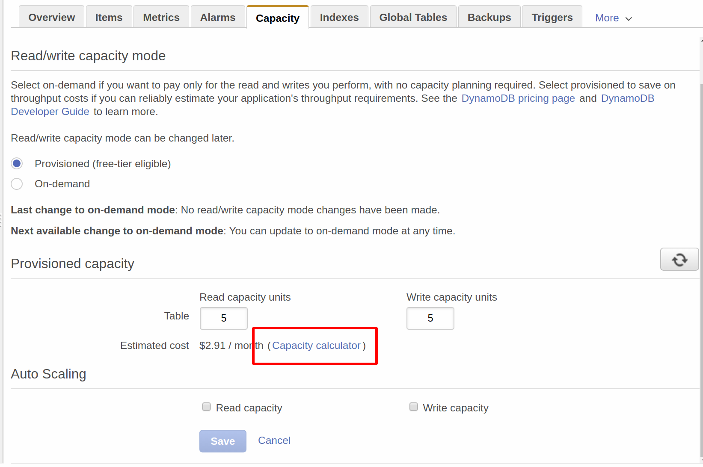

# DynamoDB


Having used AWS DynamoDB for [Alexa](http://github.com/mramshaw/Alexa-Stuff/tree/master/DynamoDB),
it was time to investigate DynamoDB as a NoSQL database in its own right.

## Contents

The contents are as follows:

* [Motivation](#motivation)
    * [DBaaS](#dbaas)
    * [Auto-scaling](#auto-scaling)
    * [Global Tables](#global-tables)
    * [Advanced query capabilities](#advanced-query-capabilities)
    * [Ease of use](#ease-of-use)
* [Alternatives](#alternatives)
    * [AWS](#aws)
    * [Third-Party](#third-party)
* [Performance](#performance)
* [Costs](#costs)
    * [Capacity](#capacity)
    * [Reserved Capacity](#reserved-capacity)
* [Offline use](#offline-use)
    * [Docker Tags](#docker-tags)
* [Security](#security)
    * [Web Identity Federation](#web-identity-federation)
* [Reference](#reference)
    * [Tracking Your Free Tier Usage](#tracking-your-free-tier-usage)
    * [DynamoDB Accelerator](#dynamoda-accelerator)
    * [AWS Billing and Cost Management](#aws-billing-and-cost-management)
    * [Billing alarm](#billing-alarm)
    * [Local usage](#local-usage)
* [To Do](#to-do)

## Motivation

I will be examining DynamoDB for use in ___serverless architectures___ as a replacement for
[MongoDB](http://www.mongodb.com/).

#### DBaaS

Specifically, I will be examining DynamoDB (and alternatives) for __Database as a Service (DBaaS)__ capabilities.

[A principal component of serverless architectures is the ability to outsource the bulk of database operations.]

In particular, the ability to scale and maintain NoSQL databases at enterprise levels can involve substantial time
and costs.

DBaaS is generally a premium cloud offering and can get expensive quickly. Even so, it's still probably far less
expensive than managing an on-premises database. The choice of cloud provider is important as egress charges tend
to be prohibitive (MongoDB Atlas can use any of the major cloud providers).

#### Auto-scaling

DynamoDB auto-scaling is relatively simple but probably does not extend across AWS regions.

#### Global Tables

AWS offers [Global Tables](http://aws.amazon.com/dynamodb/global-tables/) for replication across regions.

[This is a premium service, and may well be overkill for most use cases.]

#### Advanced query capabilities

To the extent that they are needed, Advanced query capabilities (text search, JSON parsing) are nice to have.

Of course, for more complicated use cases GraphQL is an option, but this is to be avoided if at all possible.

#### Ease of use

Consistent with usage and query requirements, it should as simple as possible to use and manage.

[DocumentDB is simple to set up and administrate, although the IAM aspects can be tricky.]

## Alternatives

The following is a quick list of alternatives to DynamoDB.

Some notes will be listed, otherwise how to evaluate DocumentDB against the alternatives?

[It will be assumed that what is required is a JSON-friendly NoSQL DBaaS that can auto-scale.]

Wikipedia has a good (if slightly out-of-date) summary of the alternatives: http://en.wikipedia.org/wiki/DBaaS

> NoSQL databases are built to service heavy read/write loads and can scale up and down easily

[The article makes no mention of either AWS DocumentDB or Azure DocumentDB.]

#### AWS

[Amazon DocumentDB](http://aws.amazon.com/documentdb/)

* Seems to have been designed as a drop-in replacement for MongoDB
* Apparently runs on Aurora PostgreSQL under the covers
* Does not support all [MongoDB data types](http://docs.aws.amazon.com/documentdb/latest/developerguide/mongo-apis-data-types.html)
* Probably overkill for simple use cases
* Probably not a good choice for greenfield applications
* Apparently has the same price structure as MongoDB Atlas
* Requires a VPC (additional costs & doesn't help with Lambda cold starts)

#### Third-Party

[MongoDB Atlas](http://docs.atlas.mongodb.com/getting-started/)

* Offers a choice of cloud providers (AWS, Azure, GCP)
* Seems to offer global clusters which pair well with [GCP's global VPCs](http://cloud.google.com/vpc/)
* Offers the widest JSON support (including BSON)
* Uses [JSON query syntax](http://docs.mongodb.com/manual/reference/operator/)
* Has a free tier which doesn't require a credit card
* Seems to be playing catch-up with AWS and Azure (both of which have competing offerings)
* Scaleable, both horizontally and vertically, but does not auto-scale
* Apparently has the same price structure as AWS DocumentDB

[Azure Cosmos DB](http://azure.microsoft.com/en-us/services/cosmos-db/)

* Apparently rebranded from Azure DocumentDB in 2017

[I am unfamiliar with Azure so I won't be examining this product.]

[CouchBase](http://www.couchbase.com/)

* Seems to have better scaling and replication options
* Probably more JSON-friendly than its competitors (apart from MongoDB)
* Has its own query language (N1QL)
* Not really DBaaS

[Check out my [Couchbase repo](http://github.com/mramshaw/RESTful-Couchbase).]

## Performance


If performance becomes an issue, it is always possible to add a caching layer with
[Amazon DynamoDB Accelerator (DAX)](http://aws.amazon.com/dynamodb/dax/).

[DAX went GA in June, 2017.]

## Costs

DynamoDB has a handy cost calculator, which is tied to DynamoDB Capacity.

It is accessible via the DynamoDB ___Capacity___ tab.

For more precise estimates, there is the ___Capacity calculator___ (available via a link).

#### Capacity

DynamoDB has sensible default values. These can be easily modified after the fact:



#### Reserved Capacity

Once production volumes have become established (after a few months running in production perhaps),
it is possible to reserve DynamoDB capacity. This is a moderately long-term commitment (one or three
years) but offers discounts. The capacity to reserve should be based upon the expected usage. The cost
factor will play into this calculation of course; the higher the capacity reserved, the greater the
cost savings.

[Costs can be expected to decrease, so apparently the one year option is the term to choose.]


## Offline use

DynamoDB is available for [local use](http://docs.aws.amazon.com/amazondynamodb/latest/developerguide/DynamoDBLocal.html).

[This may well be coupled with AWS CloudFormation (which can run locally) or [LocalStack](http://github.com/localstack/localstack).]

Probably the best option is to use the [Dockerized version](http://hub.docker.com/r/amazon/dynamodb-local):

```bash
$ docker run -p 8000:8000 amazon/dynamodb-local
```

Usage notes:

    http://docs.aws.amazon.com/amazondynamodb/latest/developerguide/DynamoDBLocal.UsageNotes.html

#### Docker Tags

You can find the Docker tags [here](http://hub.docker.com/r/amazon/dynamodb-local/tags).

The example shown above really defaults to:

```bash
$ docker run -p 8000:8000 amazon/dynamodb-local:latest
```

And a better option is to use a tagged version as follows:

```bash
$ docker run -p 8000:8000 amazon/dynamodb-local:tag
```

## Security

My approach to security involves the principle of ___Least Privilege___.

Accordingly, it's better to allocate 'YourTableName' manually rather than give Create permission.

For online use, restrict access as follows:

	{
	  "Version": "2012-10-17",
	  "Statement": [
	    {
	      "Effect": "Allow",
	      "Action": [
	        "dynamodb:PutItem",
	        "dynamodb:GetItem"
	      ],
	      "Resource":["arn:aws:dynamodb:us-east-1:xxxxxxxxxxxx:table/YourTableName"],
	    }
	  ]
	}

#### Web Identity Federation

DynamoDB offers [Web Identity Federation](http://docs.aws.amazon.com/amazondynamodb/latest/developerguide/WIF.html).

## Reference

As always with the cloud, documentation is voluminous. Some useful links are listed below.

#### Tracking Your Free Tier Usage

Tracking Your Free Tier Usage:

    http://docs.aws.amazon.com/awsaccountbilling/latest/aboutv2/tracking-free-tier-usage.html

#### DynamoDB Accelerator

DAX as a drop-in accelerator for DynamoDB:

    http://www.allthingsdistributed.com/2017/06/amazon-dynamodb-accelerator-dax.html

> With DAX, we've created a fully managed caching service that is API-compatible with DynamoDB.

And:

> With DAX, you get faster reads, more throughput, and cost savings - without having to write any new code.

#### AWS Billing and Cost Management

What Is AWS Billing and Cost Management?:

    http://docs.aws.amazon.com/awsaccountbilling/latest/aboutv2/billing-what-is.html

#### Billing Alarm

Billing alarm:

    http://docs.aws.amazon.com/AmazonCloudWatch/latest/monitoring/monitor_estimated_charges_with_cloudwatch.html

> You must be signed in using AWS account root user credentials; IAM users cannot enable billing alerts for your AWS account.

#### Local usage

Local usage notes:

    http://docs.aws.amazon.com/amazondynamodb/latest/developerguide/DynamoDBLocal.UsageNotes.html

## To Do

- [x] Investigate MongoDB DBaaS offering (Atlas)
- [ ] Investigate MongoDB Atlas free tier
- [ ] Investigate DynamoDB data residency (in terms of regions)
- [x] Investigate DynamoDB Capacity, Reserved Capacity, and Cost Calculator
- [ ] Test DynamoDB Accelerator (DAX)
- [ ] Investigate DynamoDB offline use
- [ ] Investigate [AWS Cost Explorer](http://docs.aws.amazon.com/awsaccountbilling/latest/aboutv2/ce-enable.html)
- [ ] Investigate AWS Budgets (budgeting, cost allocation tags, alerts, consolidated billing)
- [ ] Investigate AWS billing alerts
- [ ] Investigate AWS current IAM and RBAC
- [ ] Verify if the access permissions shown above are still current
- [ ] Investigate [Web Identity Federation](http://docs.aws.amazon.com/amazondynamodb/latest/developerguide/WIF.html)
- [ ] Investigate DynamoDB auto-scaling
- [ ] Test DynamoDB [Global Tables](http://aws.amazon.com/dynamodb/global-tables/)
